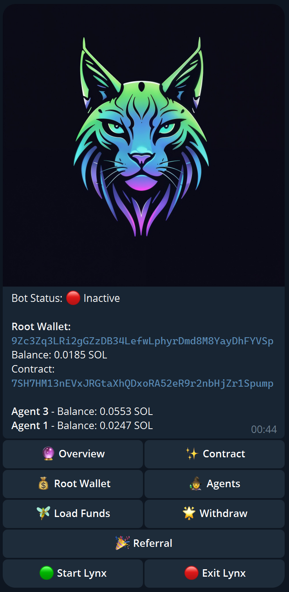
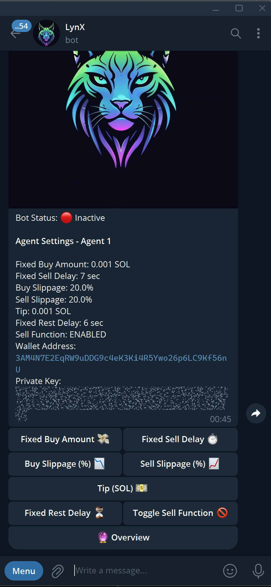

# Whitepaper: Autonomous Trading Bot with AI Agents

*Version 1.0*  
*Date: 2025-02-08*

---

## Table of Contents

- [Introduction](#introduction)
- [Project Overview](#project-overview)
- [Current Features](#current-features)
- [Technical Architecture](#technical-architecture)
- [Roadmap](#roadmap)
  - [Phase 1: Stabilization and Core Feature Completion](#phase-1-stabilization-and-core-feature-completion)
  - [Phase 2: Advanced Trading Strategies & AI Integration](#phase-2-advanced-trading-strategies--ai-integration)
  - [Phase 3: User Experience and Ecosystem Expansion](#phase-3-user-experience-and-ecosystem-expansion)
- [Future Enhancements](#future-enhancements)
- [Conclusion](#conclusion)
- [References](#references)

---

## Introduction

The Autonomous Trading Bot with AI Agents is a modular, blockchain-based trading platform designed for the Solana ecosystem. The platform leverages automated agent wallets to perform dynamic buy-and-sell cycles using the Jupiter API and Solana blockchain. Our aim is to provide users with a flexible and scalable system for automated trading while laying the groundwork for future integration of artificial intelligence and machine learning-driven strategies.

---

## Project Overview

This project combines several key functionalities:

- **Wallet Management:**  
  Support for a primary (Root) wallet and multiple agent wallets. Users can generate, import, export, and delete wallets.

- **Agent-Based Trading Automation:**  
  Each agent wallet executes independent trading cycles based on customizable settings such as fixed buy amounts, slippage tolerances, and delays.

- **Blockchain and API Integration:**  
  Seamless interaction with the Solana blockchain for balance checks and transactions, as well as the Jupiter API for real-time token swap quotes and execution.

- **User-Friendly Interface:**  
  An interactive Telegram bot interface allows users to manage wallets, configure trading agents, load funds, and monitor trades via a series of intuitive commands and inline menus.
  

---

## Current Features

- **Dynamic Wallet Management:**  
  - Root Wallet: Generate, import, export, and delete.
  - Agent Wallets: Create, manage, and delete up to 10 agents per user.
  
- **Automated Trading Cycle:**  
  - Autonomous buy–then–sell cycles per agent.
  - Configurable parameters per agent (buy amount, sell delay, rest delay, slippage, etc.).
  - Option to toggle the selling function and copy settings between agents.
  
- **Solana & Jupiter Integration:**  
  - Retrieve SOL and token balances.
  - Execute transactions on the Solana blockchain.
  - Retrieve real-time swap quotes and execute swaps via the Jupiter API.
  
- **Load & Withdrawal Operations:**  
  - Transfer funds from the root wallet to agents.
  - Collect excess funds from agents back to the root.
  - Withdraw funds from the root wallet to external addresses.
  
- **Interactive Telegram Interface:**  
  - Command-based and inline keyboard navigation.
  - Real-time notifications on trade execution and system status.
  - Referral system with personalized referral links.

- **Asynchronous Processing:**  
  - Fully asynchronous design allowing multiple agent cycles to run concurrently.
  - Robust error handling and detailed logging.
    

---

## Technical Architecture

The project is designed in a modular fashion with the following core components:

1. **Configuration & Global State:**  
   *config.py* – Centralizes environment variables, constants, and global state management.

2. **Database Management:**  
   *database.py* – Handles all CRUD operations and schema management using asyncpg.

3. **Blockchain Integration:**  
   *solana_integration.py* – Manages interactions with the Solana blockchain (balance retrieval, transaction execution).

4. **Jupiter API Integration:**  
   *jupiter_integration.py* – Encapsulates functionality to get quotes and execute token swaps.

5. **Trading Logic:**  
   *trading.py* – Contains the autonomous trading cycle logic for each agent wallet.

6. **Wallet & Agent Management:**  
   *wallet_management.py* & *agent_management.py* – Manage the creation, configuration, and deletion of wallets and agents.

7. **Fund Transfers:**  
   *load_withdrawal.py* – Handles loading funds to agents, collecting funds back, and external withdrawals.

8. **User Interaction Handlers:**  
   *handlers.py* – Implements Telegram command and callback handlers, tying together all modules.

9. **Application Entry Point:**  
   *main.py* – Initializes the application and starts the polling loop.

9. **Security:**  
   *security.py* – Initializes the security of the bot and the database.

---

## Roadmap

### Phase 1: Stabilization and Core Feature Completion

- **Bug Fixes and Performance Enhancements:**  
  - Fine-tune transaction handling and error recovery.
  - Optimize asynchronous trading cycles.
  
- **UI/UX Improvements:**  
  - Enhance Telegram inline keyboards and command flows.
  - Implement detailed logging and real-time status updates for each agent.

- **Security Auditing:**  
  - Conduct security reviews of key management and transaction signing.
  - Implement safeguards against key exposure and unauthorized access.

---

### Phase 2: Advanced Trading Strategies & AI Integration

- **Algorithmic Trading Enhancements:**  
  - Integrate advanced trading strategies (e.g., momentum trading, arbitrage detection).
  - Implement customizable risk management rules per agent.

- **AI & Machine Learning Integration:**  
  - Develop prototype models to predict market trends using historical data.
  - Allow agents to adjust strategies based on AI recommendations.
  - Explore reinforcement learning to optimize agent trading behaviors over time.

- **Real-Time Data Analytics:**  
  - Build dashboards for monitoring agent performance.
  - Integrate external market data feeds for enriched decision-making.

---

### Phase 3: User Experience and Ecosystem Expansion

- **Social Trading Features:**  
  - Implement a system for users to share successful agent configurations.
  - Introduce leaderboards, performance rankings, and community insights.
  
- **Integration with Additional Blockchains & DEXs:**  
  - Extend support beyond Solana to other blockchain networks.
  - Integrate with additional decentralized exchanges and liquidity providers.
  
- **Mobile and Web Dashboard:**  
  - Develop a companion web/mobile interface for advanced monitoring and configuration.
  - Provide real-time analytics, historical performance data, and agent management tools.
  
- **API and Plugin Ecosystem:**  
  - Create public APIs for third-party integrations.
  - Allow community-developed plugins to extend trading strategies and analytics.

---

## Future Enhancements

- **Enhanced Risk Management:**  
  - Auto-stop trading conditions based on market volatility.
  - Portfolio rebalancing across agents to mitigate risk.

- **Automated Fund Management:**  
  - Smarter algorithms for fund allocation between the root and agent wallets.
  - Dynamic fund collection strategies based on agent performance metrics.

- **User Personalization:**  
  - Tailored notifications and detailed agent performance reports.
  - Customizable dashboards and analytics for individual users.

- **Robust Community Features:**  
  - Referral incentives and social trading integrations.
  - Community-driven strategy sharing and peer-to-peer performance comparisons.

---

## Conclusion

The Autonomous Trading Bot with AI Agents is a forward-thinking solution designed to harness the power of blockchain technology and automated trading strategies. With its modular architecture, robust feature set, and scalable design, the project is poised to evolve into a full-fledged trading ecosystem that can adapt to future market dynamics and integrate advanced AI methodologies.

---

## References

- [Solana Documentation](https://docs.solana.com)
- [Jupiter API Documentation](https://docs.jup.ag)
- [Aiogram Documentation](https://docs.aiogram.dev)
- [Asyncpg Documentation](https://magicstack.github.io/asyncpg/)

